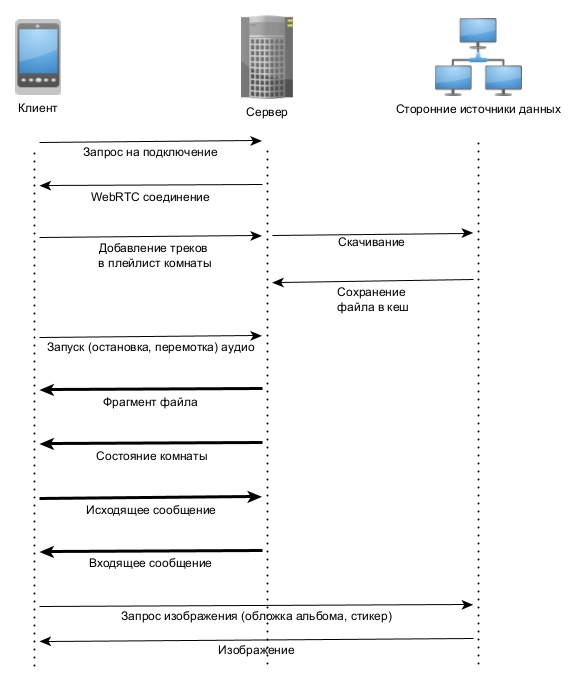
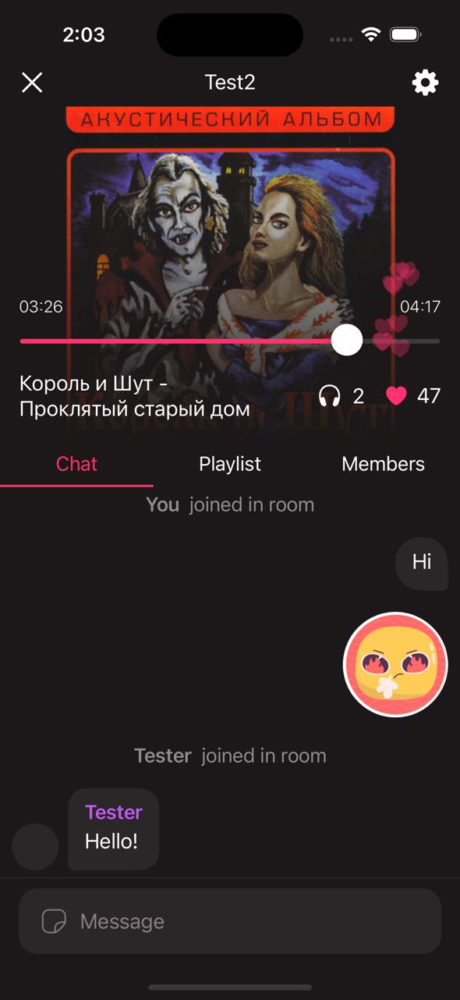
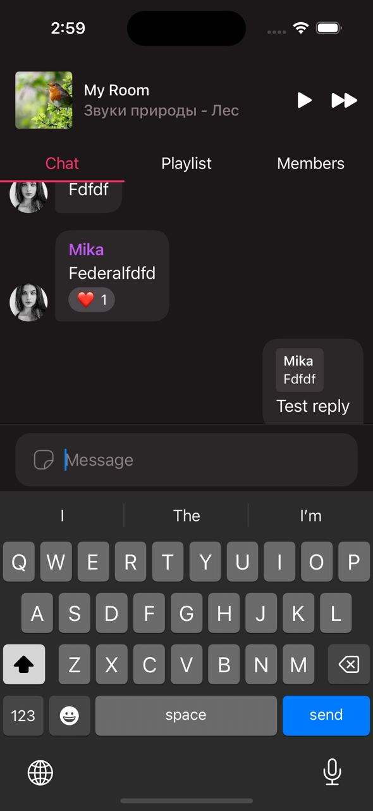
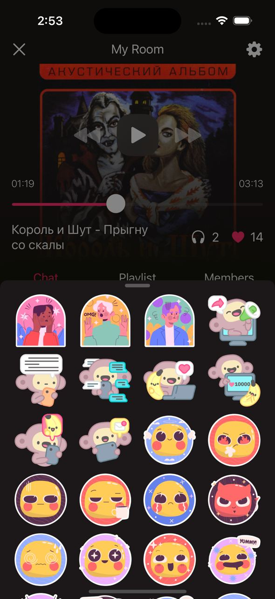
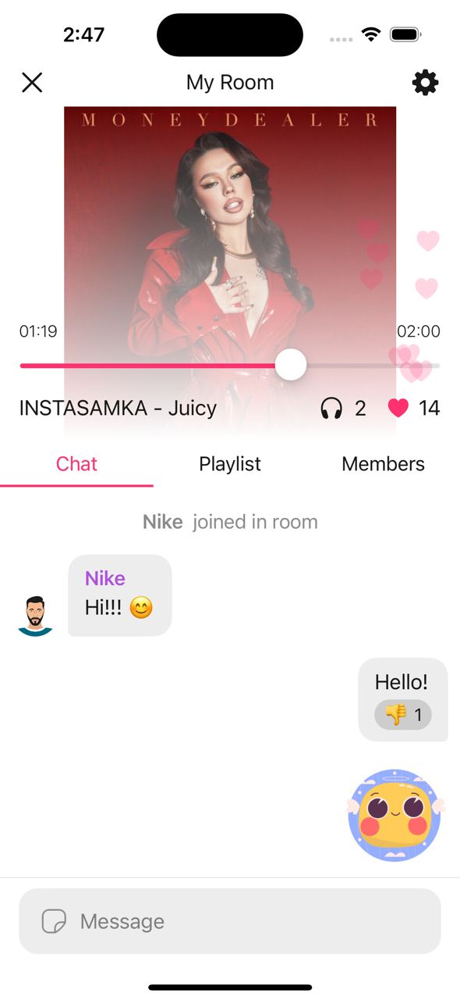
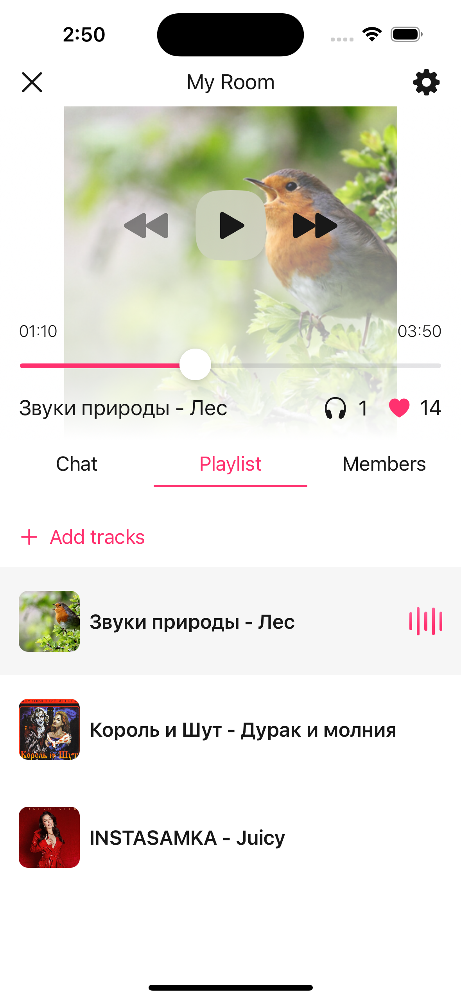

# Soundwave

Приложение для группового
онлайн-прослушивания аудиоконтента

### Команда - Brightlab 👨‍💻
- Зыков Богдан
- Таций Евгений
- Ерошенкова Анжелика
- Боярская Екатерина

### Мобильное приложение написано для iOS с архитектурой MVVM на языке Swift 

#### Используемые фреймворки и библиотеки:

Клиент часть:
- SwiftUI - верстка интерфейса
- Combine - асинхронность и реактивность
- Apollo GraphQL - обработка запросов API
- NukeUI - кеширование изображений 
- WebRTC - каналы данных и аудиопоток

Серверная часть:
- Go
- SQlite
- Apollo GraphQL
- WebRTC

## Функционал:
- Регистрация пользователя (почта/пароль)
- Список комнат
- Создание публичных и приватных комнат
- Подключение к комнате по коду
- Управление комнатой администратором
- Составление плейлиста комнаты
- Синхронизация аудио между всеми участниками максимальные задержки не более 0.2c
- Действия с аудио перемотка, переключение 
- Чат между участниками
- Aнимированные лайки комнаты
- Реакции на сообщения
- Стикеры в сообщении
- Светлая темная тема

  ## 📹 Video

## Запуск сервера
- go v.1.21.1
- brew install golang
- сd server
- go build -o audio-stream && ./audio-stream

## Схема проекта
 

 
 

## Screenshots 📷
  

 
  
    
    
    
     
  

